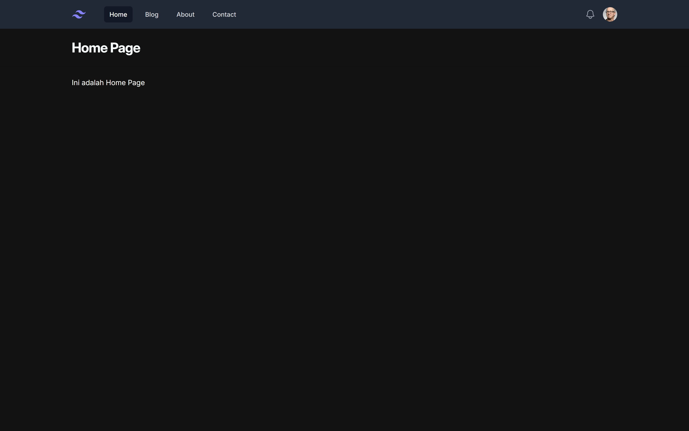
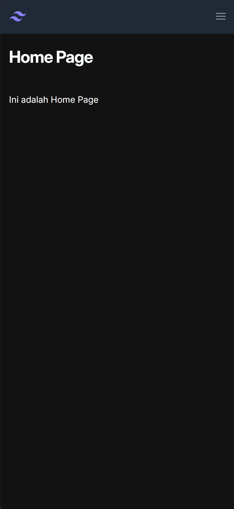
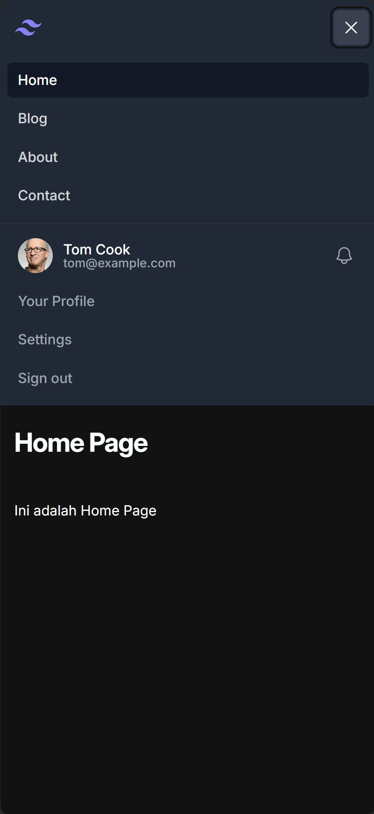
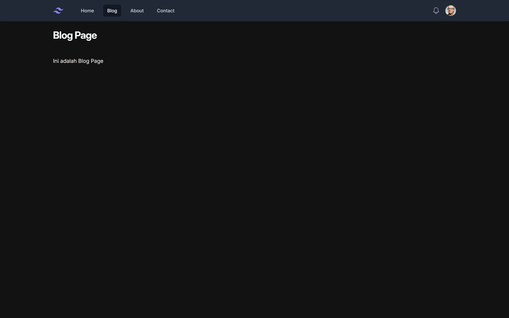
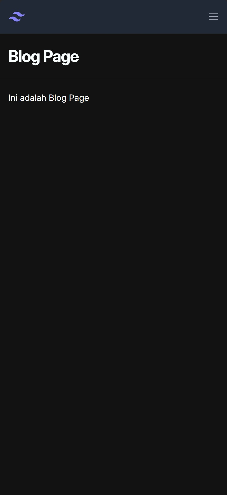
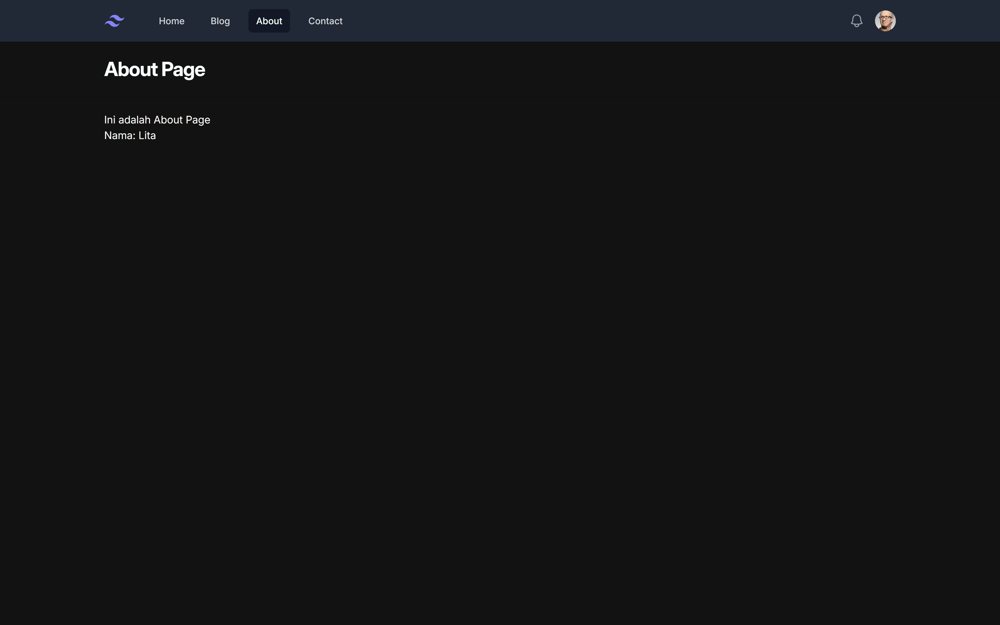
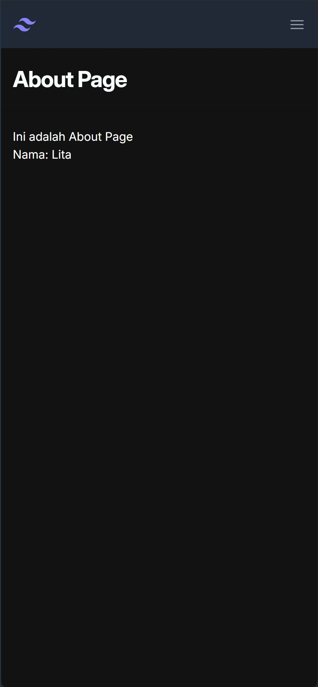
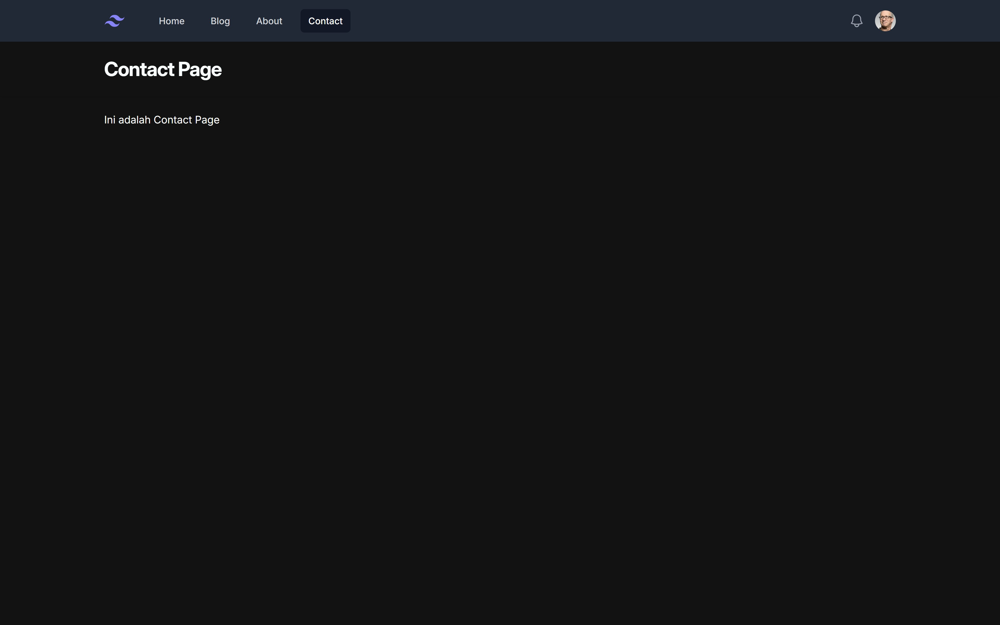
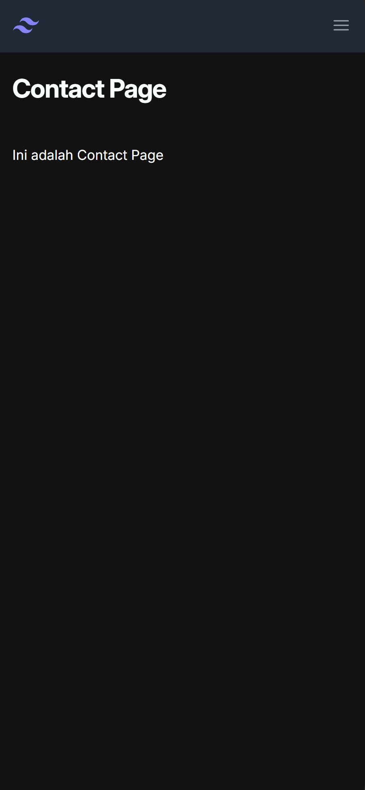

| Nama | NRP |
|---------------------------|------------|
|Syarifah Talitha Erfany | 5025211175 |

## Daftar Isi
- [Tugas 1](#tugas-1)
    - [Home Page](#home-page)
    - [Blog Page](#blog-page)
    - [About Page](#about-page)
    - [Contact Page](#contact-page)

- [Tugas 2](#tugas-2)

## Tugas 1
### Home Page 
- **Laptop :**



- **Mobile :**





**Penjelasan :**
```
<x-layout>
  <x-slot:title>
    {{ $title }}
  </x-slot:title>
  <h3 class="text-l"> Ini adalah Home Page </h3>
</x-layout>
```

Menggunakan navbar dan layout yang telah diabstraksi menjadi component yang dipanggil dalam home page. Menggunakan title yang telah diberikan dalam routing.

**Nav-link :**
```
<a {{  $attributes }}
class="{{ $active ? 'bg-gray-900 text-white' : "text-gray-300 hover:bg-gray-700 hover:text-white"}} rounded-md px-3 py-2 text-sm font-medium" 
aria-current="{{ request()->is('/') ? 'page' : false }}">{{ $slot }}</a>
```
Komponen yang dapat dipanggil dalam kelas navbar agar tidak looping, sehingga dapat menggunakan best practice.

### Blog Page 
- **Laptop :**



- **Mobile :**



**Penjelasan :**
```
<x-layout>
  <x-slot:title>
    {{ $title }}
  </x-slot:title>
  <h3 class="text-l"> Ini adalah Blog Page </h3>
</x-layout>
```

Menggunakan navbar dan layout yang telah diabstraksi menjadi component yang dipanggil dalam blog page. Menggunakan title yang telah diberikan dalam routing.

### About Page 
- **Laptop :**



- **Mobile :**



**Penjelasan :**
```
<x-layout>
    <x-slot:title> 
      {{ $title }}
    </x-slot:title>
    <h3 class="text-l"> Ini adalah About Page </h3>
    <p> Nama: {{ $nama }} </p>
  </x-layout>
```

Menggunakan navbar dan layout yang telah diabstraksi menjadi component yang dipanggil dalam about page. Menggunakan title yang telah diberikan dalam routing.

### Contact Page 
- **Laptop :**



- **Mobile :**



**Penjelasan :**
```
<x-layout>
    <x-slot:title>
      {{ $title }}
    </x-slot:title>
    <h3 class="text-l"> Ini adalah Contact Page </h3>
  </x-layout>
```

Menggunakan navbar dan layout yang telah diabstraksi menjadi component yang dipanggil dalam contact page. Menggunakan title yang telah diberikan dalam routing.

## Tugas 2
TBA