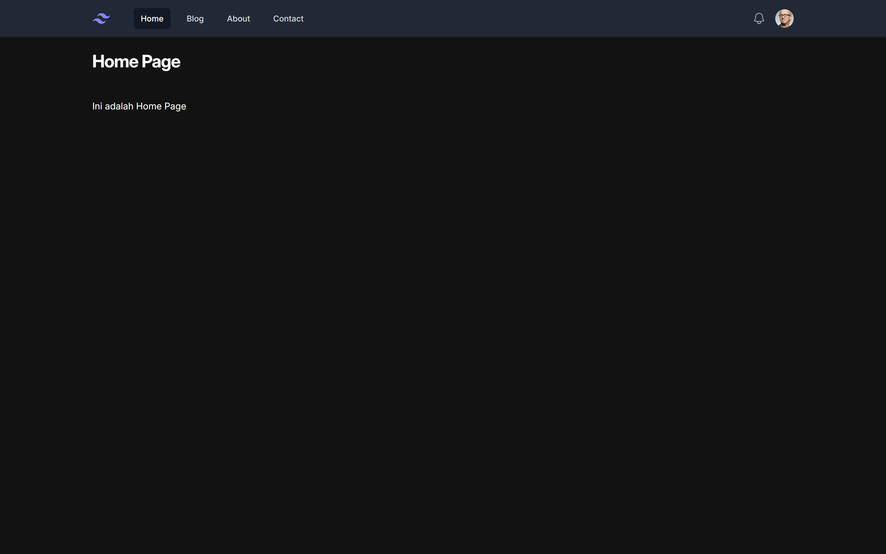
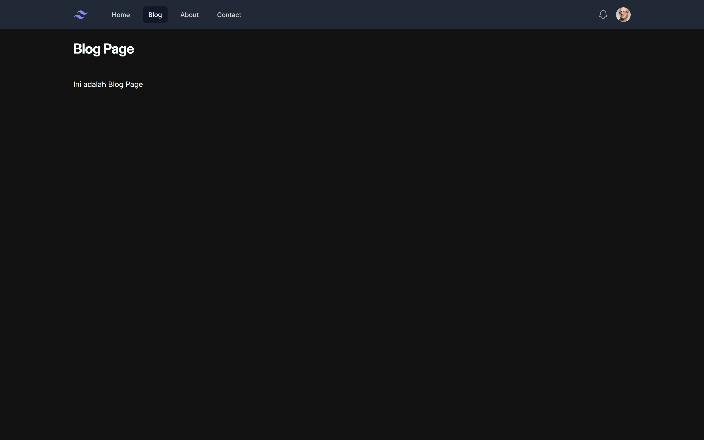
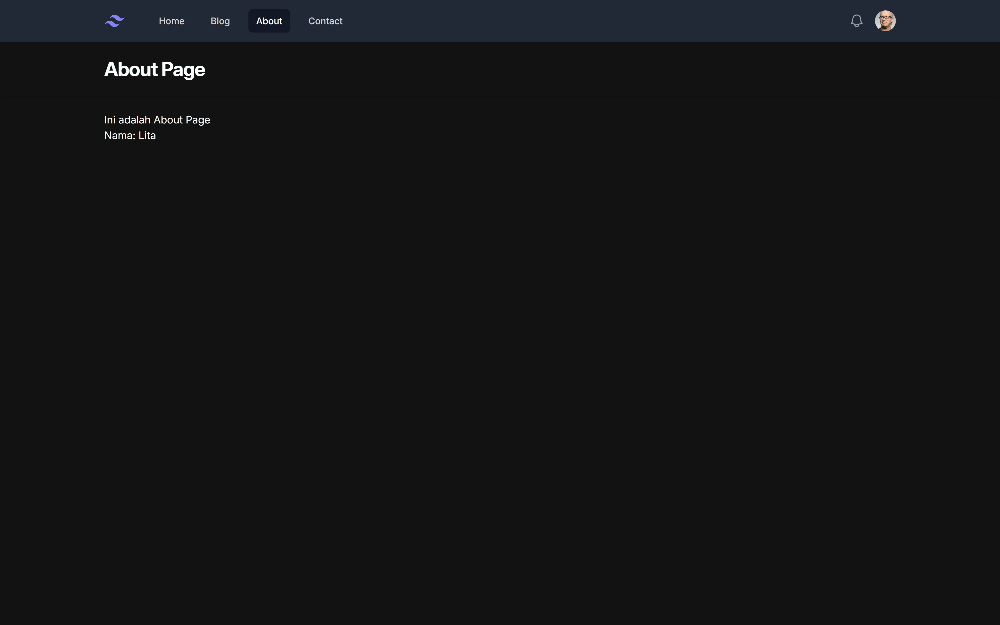
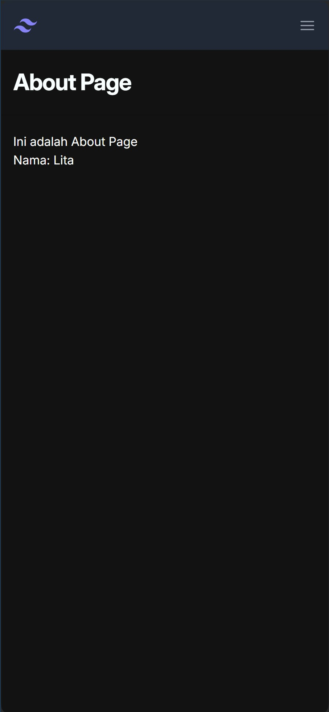
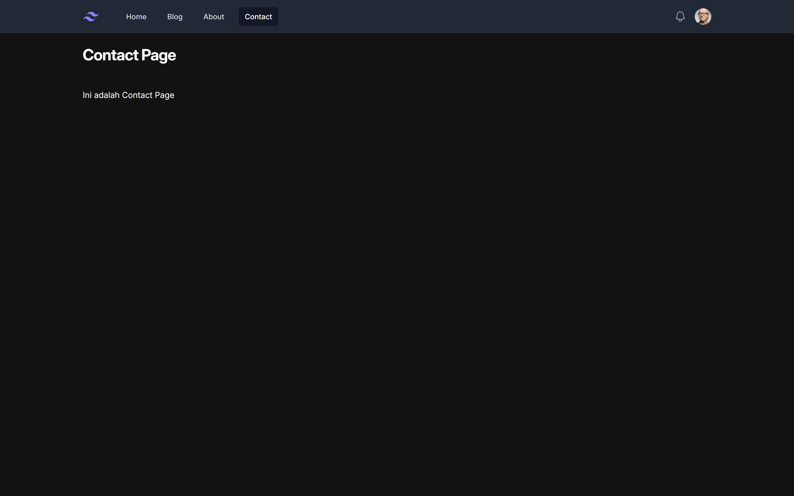

| Nama | NRP |
|---------------------------|------------|
|Syarifah Talitha Erfany | 5025211175 |

## Daftar Isi
- [Tugas 1](#tugas-1)
- [Tugas 2](#tugas-2)

## Tugas 1
### Home Page 
- **Laptop :**



- **Mobile :**


**Penjelasan :**
```
<x-layout>
  <x-slot:title>
    {{ $title }}
  </x-slot:title>
  <h3 class="text-l"> Ini adalah Home Page </h3>
</x-layout>
```

Menggunakan navbar dan layout yang telah diabstraksi menjadi component yang dipanggil dalam home page. Menggunakan title yang telah diberikan dalam routing.

**Nav-link :**
```
<a {{  $attributes }}
class="{{ $active ? 'bg-gray-900 text-white' : "text-gray-300 hover:bg-gray-700 hover:text-white"}} rounded-md px-3 py-2 text-sm font-medium" 
aria-current="{{ request()->is('/') ? 'page' : false }}">{{ $slot }}</a>
```
Komponen yang dapat dipanggil dalam kelas navbar agar tidak looping, sehingga dapat menggunakan best practice.

**Route :**
```
Route::get('/', function () {
    return view('home', ['title' => 'Home Page']);
});
```
Akan mengembalikan view ke `home`, dengan title yang di set adalah `Home Page`.

### Blog Page 
- **Laptop :**



- **Mobile :**


**Penjelasan :**
```
<x-layout>
  <x-slot:title>
    {{ $title }}
  </x-slot:title>
  <h3 class="text-l"> Ini adalah Blog Page </h3>
</x-layout>
```

Menggunakan navbar dan layout yang telah diabstraksi menjadi component yang dipanggil dalam blog page. Menggunakan title yang telah diberikan dalam routing.

**Route :**
```
Route::get('/blog', function () {
    return view('blog', ['title' => 'Blog Page']);
});
```
Akan mengembalikan view ke `blog`, dengan title yang di set adalah `Blog Page`.

### About Page 
- **Laptop :**



- **Mobile :**



**Penjelasan :**
```
<x-layout>
    <x-slot:title> 
      {{ $title }}
    </x-slot:title>
    <h3 class="text-l"> Ini adalah About Page </h3>
    <p> Nama: {{ $nama }} </p>
  </x-layout>
```

Menggunakan navbar dan layout yang telah diabstraksi menjadi component yang dipanggil dalam about page. Menggunakan title yang telah diberikan dalam routing.

**Route :**
```
Route::get('/about', function () {
    return view('about', ['title' => 'About Page', 'nama' => 'Lita']);
});
```
Akan mengembalikan view ke `about`, dengan title yang di set adalah `About Page`, memiliki atribut dari `nama = Lita`.

### Contact Page 
- **Laptop :**



- **Mobile :**


**Penjelasan :**
```
<x-layout>
    <x-slot:title>
      {{ $title }}
    </x-slot:title>
    <h3 class="text-l"> Ini adalah Contact Page </h3>
  </x-layout>
```

Menggunakan navbar dan layout yang telah diabstraksi menjadi component yang dipanggil dalam contact page. Menggunakan title yang telah diberikan dalam routing.

**Route :**
```
Route::get('/contact', function () {
    return view('contact', ['title' => 'Contact Page']);
});
```
Akan mengembalikan view ke `contact`, dengan title yang di set adalah `Contact Page`.

## Tugas 2 - **View Data & Model**
### Perbaikan Atribut di Navbar

Atribut tambahan seperti `aktif="aktif"` yang muncul di elemen HTML perlu dihapus

**Penjelasan :**
```
@props(['aktif' => false])
```

1. Gunakan properti props di Blade untuk menyimpan atribut komponen.
2. Atribut `aktif` sekarang hanya digunakan di dalam komponen, bukan di elemen HTML.

### Mengirimkan Data ke View

**Penjelasan :**
```
Route::get('/post', function () {
    return view('post', [
        'title' => 'Halaman Post',
        'posts' => [
            [
                'title' => 'Judul Artikel 1',
                'author' => 'Sandika Gali',
                'body' => 'Lorem ipsum dolor sit amet.',
                'slug' => 'judul-artikel-1'
            ],
            [
                'title' => 'Judul Artikel 2',
                'author' => 'Sandika Gali',
                'body' => 'Lorem ipsum dolor sit amet, consectetur adipiscing elit.',
                'slug' => 'judul-artikel-2'
            ]
        ]
    ]);
});
```

1. Data dikirim dalam bentuk associative array dan langsung diekstrak sebagai variabel di view.

### Membuat Halaman Blog

- **HTML Markup:**
Menggunakan elemen `<article>` untuk menampilkan setiap postingan.
Tambahkan elemen judul `(<h2>)`, penulis, tanggal, dan paragraf isi artikel. Lalu berikan tombol Read More untuk setiap artikel.

- **CSS Tailwind:**
Untuk styling gunakan `py-8`, `max-w-screen-md`, dan `border-gray-300`.

**Penjelasan :**
```
@foreach ($posts as $post)
<article>
    <h2>{{ $post['title'] }}</h2>
    <p>{{ $post['author'] }}</p>
    <p>{{ Str::limit($post['body'], 100) }}</p>
    <a href="/post/{{ $post['slug'] }}">Read More</a>
</article>
@endforeach

```

1. Gunakan `@foreach` di Blade untuk menampilkan daftar artikel


### Menampilkan Detail Artikel

Atribut tambahan seperti `aktif="aktif"` yang muncul di elemen HTML perlu dihapus

**Penjelasan :**
```
Route::get('/post/{slug}', function ($slug) {
    $posts = [
        [
            'title' => 'Judul Artikel 1',
            'author' => 'Sandika Gali',
            'body' => 'Isi lengkap artikel pertama, 
            'slug' => 'judul-artikel-1' 
        ], 
        [   'title' => 'Judul Artikel 2', 
            'author' => 'Sandika Gali', 
            'body' => 'Isi lengkap artikel kedua.', 
            'slug' => 'judul-artikel-2' 
        ] 
      ];

  $post = collect($posts)->firstWhere('slug', $slug);

  if (!$post) {
      abort(404); 
  }

  return view('post', [
      'title' => $post['title'],
      'post' => $post
  ]);
  });
```

### Slug Sebagai Identifikasi

Untuk menghindari URL yang mudah ditebak menggunakan ID numerik, gunakan `slug`.

**Slug :** string unik yang biasanya berbasis judul artikel.

Contoh slug:
> Judul Artikel 1 -> judul-artikel-1

> Judul Artikel 2 -> judul-artikel-2
Tambahkan properti slug ke setiap artikel di array data.

**Penjelasan :**
```
/post/judul-artikel-1
```

1. Dengan slug, URL menjadi lebih deskriptif dan SEO-friendly

### Fungsi Bantu Laravel

- **Str::limit:** : Membatasi jumlah karakter teks

**Penjelasan :**
```
Str::limit($post['body'], 100);
```

1. Teks hanya ditampilkan 100 karakter pertama, diakhiri dengan `...`

- **Collect:** : Mempermudah manipulasi data array.

**Penjelasan :**
```
collect($posts)->firstWhere('slug', $slug);
```

### Pentingnya Model
- **Masalah dengan Data Manual**
  - Sebelumnya, data didefinisikan langsung di dalam routes, baik untuk halaman daftar postingan maupun detail postingan.
  - Masalah:
    1. Duplikasi data pada rute-rute berbeda.
    2. Perubahan atau penambahan data membutuhkan banyak langkah.

- **Solusi dengan Model**
  - Model mengelola data secara terpusat.
  - Data diambil dari model, bukan langsung didefinisikan di rute.

### Konsep MVC
**MVC (Model-View-Controller) :** Pola arsitektur yang digunakan Laravel untuk memisahkan tanggung jawab aplikasi:

- **Model :** Mengelola data dan logika bisnis (misalnya: mengambil data dari database atau API).
- **View :** Menampilkan data kepada pengguna.
- **Controller :** Menjembatani model dan view, menangani request, dan menjalankan logika aplikasi.

**Proses Alur MVC :**

1. `User` melakukan request ke aplikasi.
2. `Router` mengarahkan request ke `Controller`.
3. `Controller` menggunakan `Model` untuk mengambil atau memproses `data`.
4. `Data` dikirim ke `View` untuk ditampilkan kepada `user`.

### Membuat Model Manual

**Langkah Membuat Model**
1. Buat file model di folder `app/Models`.

2. Contoh model sederhana `Post`:
```
namespace App\Models;

class Post {
    public static function all() {
        return [
            [
                'title' => 'Judul Artikel 1',
                'author' => 'Sandika Gali',
                'body' => 'Lorem ipsum dolor sit amet.',
                'slug' => 'judul-artikel-1'
            ],
            [
                'title' => 'Judul Artikel 2',
                'author' => 'Sandika Gali',
                'body' => 'Lorem ipsum dolor sit amet, consectetur adipiscing elit.',
                'slug' => 'judul-artikel-2'
            ]
        ];
    }

    public static function find($slug) {
        return collect(self::all())->firstWhere('slug', $slug);
    }
}

```

3. Pindahkan data dari rute ke model.

**Menggunakan Model di Rute**

1. Impor model dengan namespace
```
use App\Models\Post;
```

2. Rute untuk daftar postingan
```
Route::get('/post', function () {
    return view('post', [
        'title' => 'Halaman Post',
        'posts' => Post::all()
    ]);
});
```

3. Rute untuk detail postingan
```
Route::get('/post/{slug}', function ($slug) {
    $post = Post::find($slug);

    if (!$post) {
        abort(404);
    }

    return view('post', [
        'title' => $post['title'],
        'post' => $post
    ]);
});
```

### Fitur Autoloading dan Namespace

**Autoloading**
- Laravel menggunakan autoloading standar `PSR-4`.

- Class dalam folder `app` otomatis terdeteksi oleh Laravel, tetapi harus memiliki namespace yang sesuai.

**Namespace**
Namespace digunakan untuk menghindari konflik nama class.

1. Contoh namespace untuk model `Post`
```
namespace App\Models;
```

2. Impor model ke rute
```
use App\Models\Post;
```

### Peningkatan Model

**Membuat Fungsi find untuk Pencarian Data**

- Logika pencarian data dipindahkan dari rute ke model

```
public static function find($slug) {
    return collect(self::all())->firstWhere('slug', $slug);
}
```

**Mengatasi Error 404** 

1. Tambahkan validasi untuk menangani data yang tidak ditemukan

```
if (!$post) {
    abort(404);
}
```

### Keuntungan Menggunakan Model

**Membuat Fungsi find untuk Pencarian Data**

1. `Pengelolaan Data Terpusat :` Data hanya didefinisikan sekali di model.

2. `Mudah Dikembangkan :` Model dapat diperluas untuk integrasi dengan database, API, atau fitur lainnya.

3. `Logika Terpisah :` Controller hanya menangani logika permintaan, sedangkan logika data dikelola oleh model.